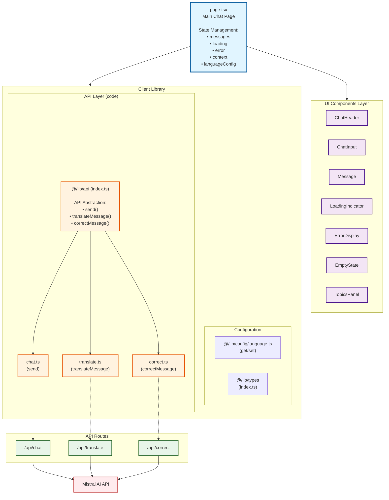
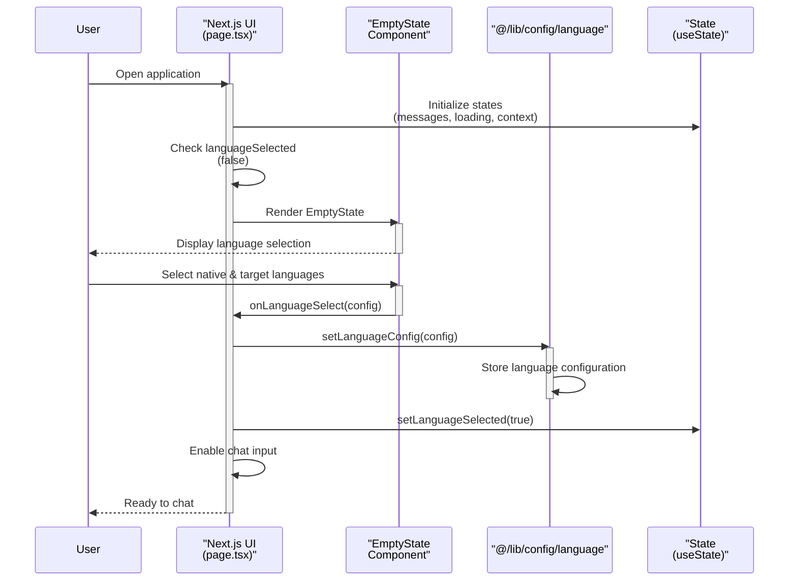
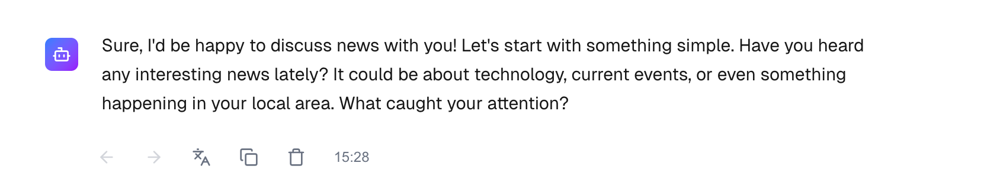
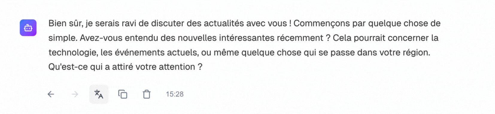
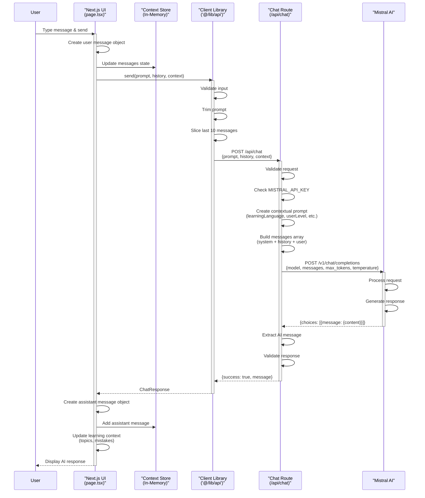
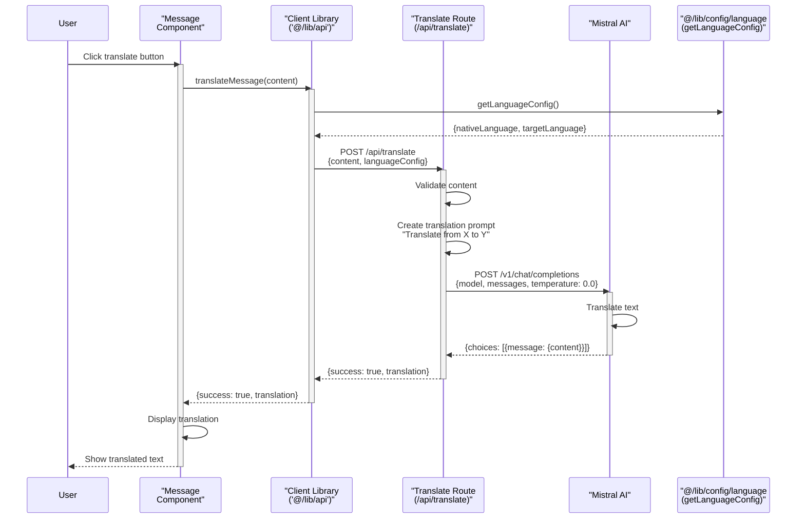

# LangBot

A Next.js-based AI-powered language learning application that helps users practice their target language through natural conversation with an intelligent tutor.

## 🌟 Features

- **Interactive Chat Interface**: Natural conversation-based language learning
- **Multi-language Support**: Configurable native and target languages
- **Real-time Translation**: Translate messages between target and native languages
- **Grammar Correction**: Automatic spelling and grammar correction
- **Topic Tracking**: Monitors conversation topics for better context
- **Conversation History**: Maintains chat history for contextual responses

## 🏗️ Architecture

### Tech Stack

- **Framework**: Next.js 14+ (App Router)
- **Language**: TypeScript
- **AI Provider**: Mistral AI (mistral-small-latest)
- **UI Components**: React with custom components
- **Styling**: Tailwind CSS

### Project Structure

```
├── README.md
├── __tests__
│   ├── integration
│   │   ├── chat.test.ts
│   │   ├── correct.test.ts
│   │   └── tranlsate.test.ts
│   └── unit
│       ├── chat.test.ts
│       ├── correct.test.ts
│       └── translate.test.ts
├── imgs
├── public
├── src
│   ├── app
│   │   ├── api
│   │   │   ├── chat
│   │   │   │   └── route.ts
│   │   │   ├── correct
│   │   │   │   └── route.ts
│   │   │   └── translate
│   │   │       └── route.ts
│   │   ├── favicon.ico
│   │   ├── globals.css
│   │   ├── layout.tsx
│   │   └── page.tsx
│   ├── components
│   │   └── ui
│   │       ├── chat
│   │       │   ├── ChatHeader.tsx
│   │       │   ├── ChatInput.tsx
│   │       │   └── Message.tsx
│   │       ├── indicators
│   │       │   └── LoadingIndicator.tsx
│   │       ├── panels
│   │       │   └── TopicsPanel.tsx
│   │       └── states
│   │           ├── EmptyState.tsx
│   │           └── ErrorDisplay.tsx
│   └── lib
│       ├── api
│       │   ├── chat.ts
│       │   ├── correct.ts
│       │   ├── index.ts
│       │   └── translate.ts
│       ├── config
│       │   └── language.ts
│       └── types
│           ├── chat.ts
│           ├── index.ts
│           ├── language.ts
│           └── mistral.ts
```


## 🚀 Getting Started

### Prerequisites

- Node.js 18+ 
- pnpm
- Mistral AI API key

### Installation

1. Clone the repository:
```bash
git clone https://github.com/Yvesei/LangBot
cd LangBot
```

2. Install dependencies:
```bash
pnpm install
```

3. Create a `.env.local` file in the root directory:
```env
MISTRAL_API_KEY=your_mistral_api_key_here
```

4. Run the development server:
```bash
pnpm dev
```

5. Open [http://localhost:3000](http://localhost:3000) in your browser

## 📖 Usage

### Initial Setup

1. **Select Languages**: On first load, choose your native language and target language
2. **Start Chatting**: Begin practicing your target language with the AI tutor




### Features Usage

#### Translation
- Messages can be translated between target and native languages
- Uses the language configuration set at startup





#### Grammar Correction
- Automatic detection of spelling and grammar mistakes
- Returns `[CORRECT]` if no mistakes found


#### Topic Tracking
- Automatically detects discussion topics (food, travel, work, hobbies, family)
- Displays topics in the sidebar
- Helps maintain conversation context

## 🔌 API Endpoints

### POST `/api/chat`

Main conversation endpoint.

**Request Body:**
```json
{
  "prompt": "Hello, how are you?",
  "history": [
    {
      "role": "user",
      "content": "Previous message"
    }
  ],
  "context": {
    "learningLanguage": "French",
    "userLevel": "beginner",
    "topicsDiscussed": ["food"],
    "commonMistakes": []
  }
}
```

**Response:**
```json
{
  "success": true,
  "message": "I'm doing well, thank you! How about you?"
}
```




### POST `/api/translate`

Translates text between configured languages.

**Request Body:**
```json
{
  "content": "Bonjour, comment allez-vous?",
  "languageConfig": {
    "targetLanguage": "fr",
    "nativeLanguage": "en"
  }
}
```

**Response:**
```json
{
  "success": true,
  "translation": "Hello, how are you?"
}
```



### POST `/api/correct`

Corrects spelling and grammar mistakes.

**Request Body:**
```json
{
  "content": "I has a appel"
}
```

**Response:**
```json
{
  "success": true,
  "correctedContent": "I have an apple"
}
```


## 🎯 AI Tutor Behavior

The AI tutor is designed to:

- **Adapt to User Level**: Adjusts language complexity based on proficiency
- **Encourage Expression**: Promotes natural conversation without harsh corrections
- **Maintain Context**: References previous topics and common mistakes
- **Stay Engaging**: Asks follow-up questions to continue conversations
- **Be Patient**: Creates a supportive learning environment


## 🔧 Configuration

### Language Configuration

Set languages programmatically:

```typescript
import { setLanguageConfig } from '@/lib/prompts';

setLanguageConfig({
  nativeLanguage: 'en',
  targetLanguage: 'fr'
});
```

### Conversation Context

```typescript
interface ConversationContext {
  messages: ChatMessage[];
  learningLanguage?: string;
  userLevel?: 'beginner' | 'intermediate' | 'advanced';
  topicsDiscussed?: string[];
  commonMistakes?: string[];
}
```

## 🔐 Security

- API keys stored in environment variables
- Trimmed user inputs to prevent injection
- Error messages don't expose sensitive information

## 📊 Performance Considerations

- **Message History Limit**: Last 8-10 messages sent to AI (token optimization)
- **Max Tokens**: 500 tokens per response
- **Temperature**: 0.7 for natural conversation, 0.0 for corrections
- **Model**: mistral-small-latest (balance of speed and quality)

## 🧪 Testing

Run tests:
```bash
pnpm test
```

## 🗺️ Roadmap
- [x] add tests
- [ ] user input validation and safe output parsing
- [ ] CI/CD
- [ ] User authentication
- [ ] Voice input/output