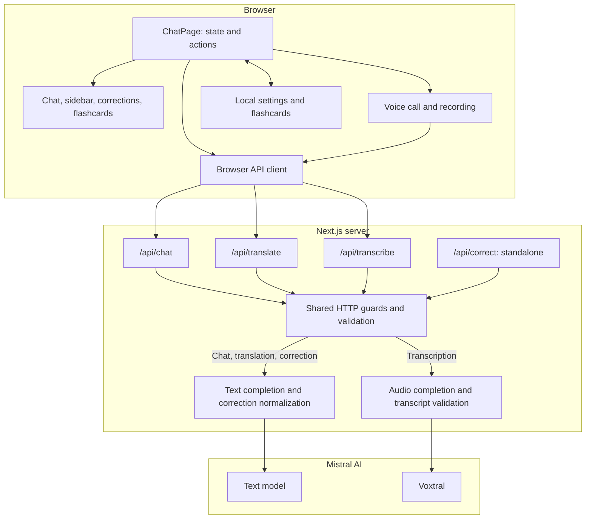
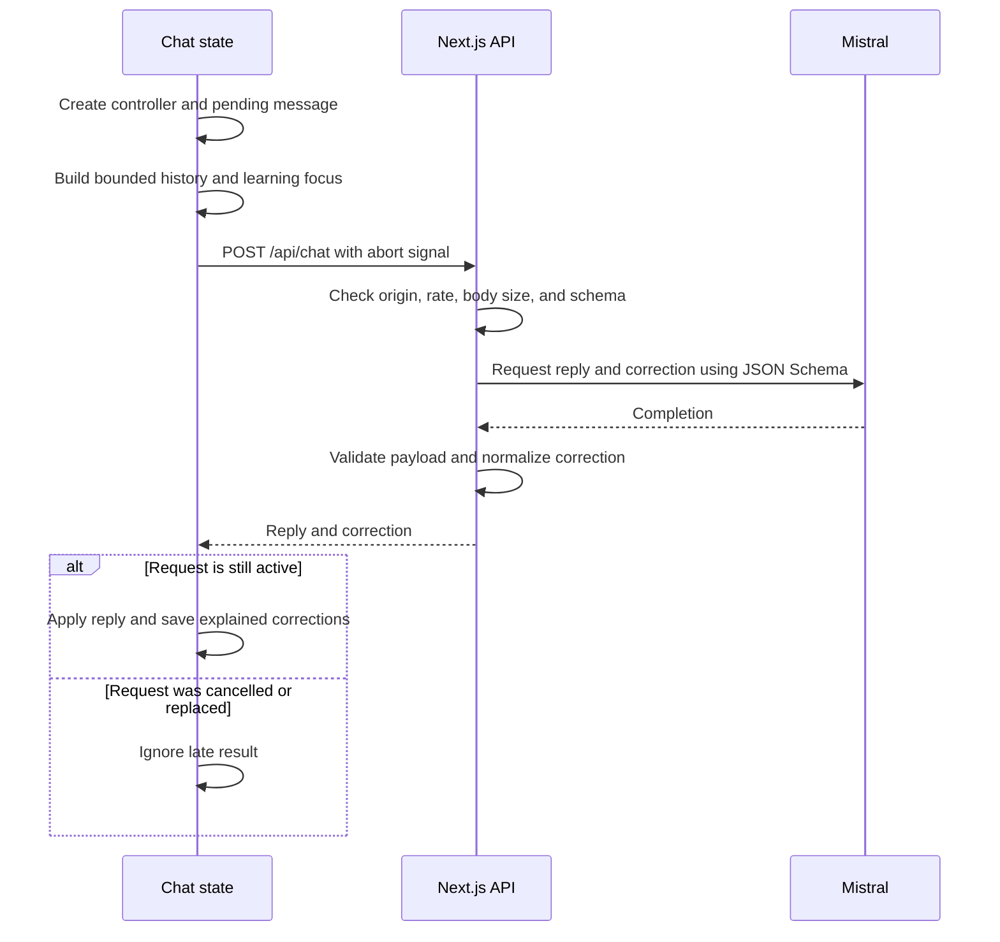
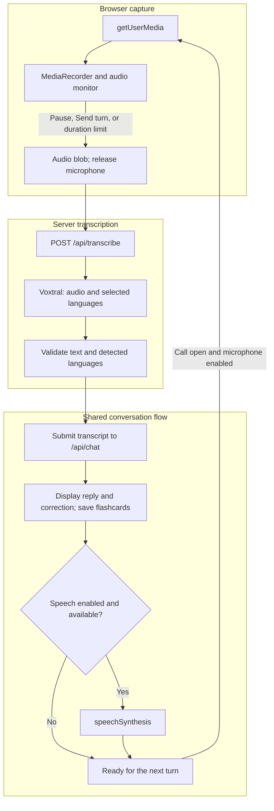
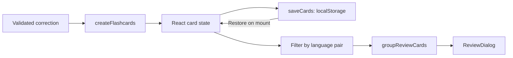

<p align="center">
  <a href="https://chat.ouchta.com">
    
  </a>
</p>

<h1 align="center">Languify</h1>

<p align="center">A full-stack language tutor built with Next.js, TypeScript, and Mistral AI.</p>

<p align="center">
  <a href="https://chat.ouchta.com"><strong>chat.ouchta.com</strong></a>
  · <a href="#implementation">Implementation</a>
  · <a href="#architecture">Architecture</a>
  · <a href="#run-locally">Run locally</a>
</p>

## Features

- **12 languages:** conversational practice, mixed-language input, and translation.
- **Corrections:** word-level diffs and native-language explanations from the chat response.
- **Flashcards:** persistent correction history, grouped by phrase and language pair.
- **Voice:** browser recording → Voxtral transcription → shared chat pipeline → speech playback.
- **UI:** two themes, responsive navigation, cancellation, retry, and message deletion.

## Tech stack

| Frontend                    | Backend & AI       | Quality & delivery           |
| --------------------------- | ------------------ | ---------------------------- |
| Next.js 15 · React 19       | Next.js API routes | Jest · React Testing Library |
| TypeScript · Tailwind CSS 4 | Mistral · Voxtral  | ESLint · Prettier · Husky    |
| MediaRecorder · Web Audio   | Zod · JSON Schema  | GitHub Actions · Vercel      |

## Architecture

### Project structure

```text
src/
├── app/
│   ├── api/                 # Chat, correction, translation, transcription
│   └── chat/                # Page, conversation state, and request hooks
├── components/ui/
│   ├── brand/               # Theme-specific logos
│   ├── chat/                # Sidebar, messages, input, and welcome screen
│   ├── setup/               # Language selection
│   ├── review/              # Flashcards and review dialog
│   └── voice/               # Call controls, transcript, and lifecycle hooks
└── lib/
    ├── api/                 # Browser requests and response validation
    ├── chat/                # Conversation history and request construction
    ├── learning/            # Card schema and browser storage
    ├── review/              # Grouping and review helpers
    ├── schemas/             # Shared request and response contracts
    ├── server/              # Prompts, provider calls, limits, and HTTP helpers
    └── voice/               # Recording, monitoring, and transcription
__tests__/
├── unit/                    # UI, state, storage, provider, and voice
└── integration/             # API routes with mocked model responses
tests/lint/                 # Custom ESLint rule tests
```

### Application flow


```mermaid
flowchart TB
    subgraph Browser["Browser"]
        Page["ChatPage: state and actions"]
        UI["Chat, sidebar, corrections, flashcards"]
        Voice["Voice call and recording"]
        Storage["Local settings and flashcards"]
        Client["Browser API client"]

        Page --> UI
        Page --> Voice
        Page <--> Storage
        Page --> Client
        Voice --> Client
    end

    subgraph Server["Next.js server"]
        Chat["/api/chat"]
        Translate["/api/translate"]
        Transcribe["/api/transcribe"]
        Correct["/api/correct: standalone"]
        Helpers["Shared HTTP guards and validation"]
        TextRequest["Text completion and correction normalization"]
        AudioRequest["Audio completion and transcript validation"]

        Chat --> Helpers
        Translate --> Helpers
        Transcribe --> Helpers
        Correct --> Helpers
    end

    subgraph Provider["Mistral AI"]
        Text["Text model"]
        Audio["Voxtral"]
    end

    Client --> Chat
    Client --> Translate
    Client --> Transcribe
    Helpers -->|Chat, translation, correction| TextRequest
    Helpers -->|Transcription| AudioRequest
    TextRequest --> Text
    AudioRequest --> Audio
```

## Implementation

| Concern              | Implementation                                                                                                                                                                         |
| -------------------- | -------------------------------------------------------------------------------------------------------------------------------------------------------------------------------------- |
| Model output         | Zod → JSON Schema with `strict: true`; validate the completion envelope and parsed payload before returning it. [Provider parsing](src/lib/server/mistral-response.ts)                 |
| Correction semantics | Reply and correction share one completion. Unexplained rewrites become `correction: null`; unchanged text returns an empty issues array. [Normalization](src/lib/server/correction.ts) |
| Async state          | An `AbortController` identifies the active request. Stale results are ignored; retries reuse the message ID. [Request hook](src/app/chat/useMessageRequest.ts)                         |
| Provider failures    | 25-second deadline; text requests retry once on `429`, `502`, `503`, or `504` if the retry delay fits a 2-second budget. [Retry logic](src/lib/server/mistral-request.ts)              |
| Context assembly     | Exclude pending/failed turns, trim history by count and encoded size, and include up to three saved correction explanations. [Request builder](src/lib/chat/conversation-request.ts)   |
| Audio lifecycle      | `MediaRecorder` format negotiation, Web Audio silence detection, generation checks, and track/timer cleanup. [Voice modules](src/lib/voice)                                            |
| Observability        | Structured completion logs include model, latency, usage, and attempts; API errors include request IDs and status. [Provider metrics](src/lib/server/mistral.ts)                       |

### Chat request lifecycle


```mermaid
sequenceDiagram
    participant UI as Chat state
    participant API as Next.js API
    participant AI as Mistral

    UI->>UI: Create controller and pending message
    UI->>UI: Build bounded history and learning focus
    UI->>API: POST /api/chat with abort signal
    API->>API: Check origin, rate, body size, and schema
    API->>AI: Request reply and correction using JSON Schema
    AI-->>API: Completion
    API->>API: Validate payload and normalize correction
    API-->>UI: Reply and correction
    alt Request is still active
        UI->>UI: Apply reply and save explained corrections
    else Request was cancelled or replaced
        UI->>UI: Ignore late result
    end
```

### API contract

All routes use the Node.js runtime. Text requests use `application/json`; transcription accepts raw audio bytes.

| POST endpoint     | Input                                                                  | Result fields         |
| ----------------- | ---------------------------------------------------------------------- | --------------------- |
| `/api/chat`       | `prompt`, `languageConfig`, optional `history` and `learningFocus`     | `reply`, `correction` |
| `/api/correct`    | `content`, `languageConfig`                                            | `correction`          |
| `/api/translate`  | `content`, `languageConfig`                                            | `translation`         |
| `/api/transcribe` | Ogg/WebM/MP4 body; `X-Native-Language` and `X-Target-Language` headers | `text`                |

Example chat request:

```json
{
  "prompt": "I need une cuillère.",
  "languageConfig": { "nativeLanguage": "fr", "targetLanguage": "en" },
  "history": [],
  "learningFocus": []
}
```

- **Success:** `{ "success": true, ...result }`.
- **Failure:** `{ "success": false, "error": "..." }` with an HTTP error status.
- **Correction:** `{ correctedText, issues: [{ category, explanation }] }` or `null` when unavailable.
- **Response headers:** guarded routes set `X-Request-ID` and `Cache-Control: no-store`; rate-limit errors can include `Retry-After`.
- **Validation:** strict request schemas, `user`/`assistant` history roles only, and two distinct supported languages.

[Request and response schemas](src/lib/schemas) · [Route wrapper](src/lib/server/http.ts) · [Response helpers](src/lib/server/http/responses.ts)

### Request limits

| Boundary             | Limit                                                          |
| -------------------- | -------------------------------------------------------------- |
| Chat prompt          | 2,000 characters                                               |
| Conversation context | 12 history messages; 20,000 combined prompt/history characters |
| JSON request         | 32 KiB; 5-second body-read deadline                            |
| Audio                | 2 MiB upload; 30-second browser recording limit                |
| Provider call        | 25 seconds, combined with caller cancellation                  |
| API rate             | 5 requests/minute across routes per resolved client identity   |

Body limits are enforced during stream reads, including without `Content-Length`. Requests with a different `Origin` are rejected. Rate counters are in-memory per server instance; a voice turn normally uses two requests.

### Voice pipeline


```mermaid
flowchart TB
    subgraph Capture["Browser capture"]
        Mic["getUserMedia"] --> Recorder["MediaRecorder and audio monitor"]
        Recorder -->|Pause, Send turn, or duration limit| Blob["Audio blob; release microphone"]
    end

    subgraph Transcription["Server transcription"]
        Upload["POST /api/transcribe"] --> Voxtral["Voxtral: audio and selected languages"]
        Voxtral --> Validate["Validate text and detected languages"]
    end

    subgraph Conversation["Shared conversation flow"]
        Submit["Submit transcript to /api/chat"] --> Render["Display reply and correction; save flashcards"]
        Render --> Playback{"Speech enabled and available?"}
        Playback -->|Yes| Speak["speechSynthesis"]
        Playback -->|No| Next["Ready for the next turn"]
        Speak --> Next
    end

    Blob --> Upload
    Validate --> Submit
    Next -->|Call open and microphone enabled| Mic
```

Closing a call aborts recording and transcription, cancels playback, and clears audio resources. An already-submitted chat request can still finish in the text conversation.

### State and persistence

| Data                    | Storage                         | Lifecycle                                               |
| ----------------------- | ------------------------------- | ------------------------------------------------------- |
| Conversation            | React state                     | Cleared on reload or new chat                           |
| Language pair and theme | `localStorage`                  | Restored on reload                                      |
| Flashcards              | Schema-validated `localStorage` | Latest 100 occurrences; no account or cross-device sync |


```mermaid
flowchart LR
    Result["Validated correction"] --> Cards["createFlashcards"]
    Cards --> State["React card state"]
    State --> Store["saveCards: localStorage"]
    Store -->|Restore on mount| State
    State --> Filter["Filter by language pair"]
    Filter --> Groups["groupReviewCards"]
    Groups --> Review["ReviewDialog"]
```

Cards retain their `sourceMessageId`; deleting a turn removes its associated cards. Review groups retain occurrence IDs so removing a group deletes all its occurrences.

## Testing & delivery

```bash
pnpm test              # All Jest tests
pnpm test:unit         # Unit and UI tests
pnpm test:integration  # Mocked API route tests
pnpm test:lint         # Custom ESLint rule tests
pnpm test:coverage     # Jest coverage report
pnpm test:watch        # Rerun Jest tests as files change
```

Run a specific test file:

```bash
pnpm test __tests__/unit/page.test.tsx
```

Additional checks:

```bash
pnpm lint              # ESLint
pnpm typecheck         # TypeScript
pnpm build             # Production build
```

| Tests          | Scenarios                                                                       |
| -------------- | ------------------------------------------------------------------------------- |
| Chat & review  | Cancellation, late responses, retries, saved cards, language isolation          |
| Voice          | Permission failures, missing playback, mixed-language input, microphone cleanup |
| Provider & API | Malformed output, retry limits, validation, shared rate limits                  |
| Lint tooling   | Custom rule detection and automatic fixes                                       |

- **CI:** lint → typecheck → unit + integration + lint-rule tests → production build.
- **Pre-commit:** ESLint and Prettier through Husky and lint-staged.
- **Deployment:** Vercel previews and production through Git integration.
- **Test isolation:** mocked model responses; no API credits required.

[Browse tests](__tests__) · [CI workflow](.github/workflows/test.yml) · [Custom lint rule](eslint-function-spacing.mjs)

## Run locally

**Requires:** Node.js 22 and pnpm 12 — corepack picks up the pinned version from the `packageManager` field. The Supabase SDK requires Node.js 22 or later. `pnpm-workspace.yaml` approves the native dependency install scripts used by the app so fresh installs can run non-interactively in CI and Docker.

```bash
git clone https://github.com/Yvesei/LangBot.git languify
cd languify
pnpm install --frozen-lockfile
cp .env.example .env.local
```

Set `.env.local` (`MISTRAL_API_KEY` is required; model variables override the defaults; Supabase variables are optional and enable Google sign-in):

```env
MISTRAL_API_KEY=your_mistral_api_key_here
MISTRAL_MODEL=ministral-8b-latest
MISTRAL_TRANSCRIPTION_MODEL=voxtral-small-latest
NEXT_PUBLIC_SUPABASE_URL=
NEXT_PUBLIC_SUPABASE_ANON_KEY=
NEXT_PUBLIC_GUEST_MESSAGE_LIMIT=5
```

```bash
pnpm dev
```

Open [localhost:3000](http://localhost:3000). Voice recording requires localhost or HTTPS. Development output uses `.next-dev`; production builds use `.next`.

### Docker

Requires Docker with Compose. Create `.env.local` from `.env.example` and set your Mistral API key, then:

```bash
docker compose --env-file .env.local up --build -d
docker compose logs -f app
docker compose down
```

`--env-file` also feeds the Supabase build args (next section); without it auth compiles out and the container still runs guest-mode.

Open [localhost:3000](http://localhost:3000). Mistral credentials are loaded at runtime; the public Supabase URL/key are passed as build args. `.env` files are excluded from the build context.

The multi-stage image uses [Next.js standalone output](https://nextjs.org/docs/app/api-reference/config/next-config-js/output) and runs as a non-root user.

### Optional sign-in (Supabase Auth)

Auth is optional: without the variables below the app stays in guest mode with no login UI.

1. Create a project at [supabase.com](https://supabase.com) and note its URL and anon key.
2. Enable **Google** under _Auth → Providers_. In [Google Cloud console](https://console.cloud.google.com/apis/credentials), create an OAuth 2.0 web client and add your Supabase project's callback URL, `https://<project-ref>.supabase.co/auth/v1/callback`, as an authorized redirect URI.
3. In Supabase _Auth → URL Configuration_, add `http://localhost:3000/auth/callback` and, for production, `https://<your-domain>/auth/callback` as allowed redirect URLs.
4. Set `.env.local` (or Vercel project env vars):

```env
NEXT_PUBLIC_SUPABASE_URL=https://<project>.supabase.co
NEXT_PUBLIC_SUPABASE_ANON_KEY=<anon/public key>
# Optional server-only key for shared rate limits across serverless instances.
# Never prefix this key with NEXT_PUBLIC_.
SUPABASE_SERVICE_ROLE_KEY=
```

Newer Supabase projects issue the public key as `NEXT_PUBLIC_SUPABASE_PUBLISHABLE_KEY`; either variable name works.

Google sign-in does not require application database tables; chats and flashcards currently remain in browser state/storage.

Shared rate limiting requires a separately provisioned, service-role-only `register_rate_limit_hit(p_identity_key text, p_window_seconds integer, p_max_hits integer)` RPC that returns exactly one row with `allowed boolean` and `retry_after_seconds integer`. Set `SUPABASE_SERVICE_ROLE_KEY` only after provisioning this RPC. If that configured service is unavailable, API requests return 503 until it recovers. Without the service key, the app uses a per-instance in-memory limit.

On Vercel you can alternatively install the [Supabase integration](https://vercel.com/integrations/supabase) and link the project, which injects these variables automatically. If the integration also supplies `SUPABASE_SERVICE_ROLE_KEY`, leave it unset until the rate-limit RPC is provisioned. Signed-in learners get their own rate-limit bucket; guests keep the shared anonymous limits.

The browser prompts guests to sign in after five completed chat messages. This allowance is stored in localStorage and synchronizes across tabs; it is a UI prompt, not a server-enforced access quota. The API rate limit applies independently. Change `NEXT_PUBLIC_GUEST_MESSAGE_LIMIT` to adjust the allowance. The setting is included in the client bundle, so rebuild and redeploy after changing it.

[Graphify setup and code navigation](docs/graphify.md)
