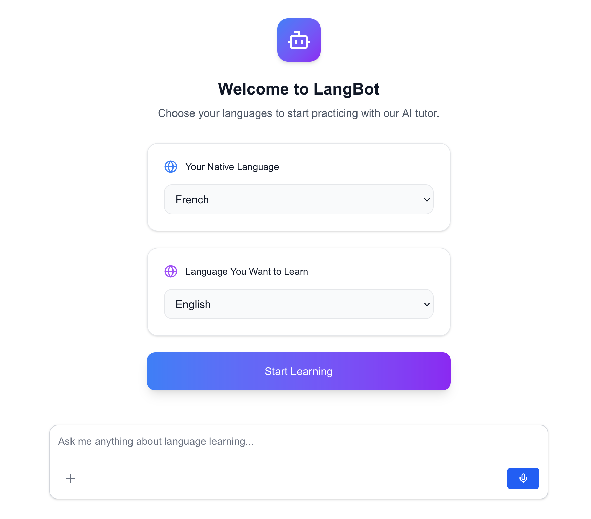

# LangBot

A Next.js-based AI-powered language learning application that helps users practice their target language through natural conversation with an intelligent tutor.

## 🌟 Features

- **Interactive Chat Interface**: Natural conversation-based language learning
- **Multi-language Support**: Configurable native and target languages
- **Real-time Translation**: Translate messages between target and native languages
- **Grammar Correction**: Automatic spelling and grammar correction
- **Topic Tracking**: Monitors conversation topics for better context
- **Conversation History**: Maintains chat history for contextual responses

## 🏗️ Architecture

### Tech Stack

- **Framework**: Next.js 14+ (App Router)
- **Language**: TypeScript
- **AI Provider**: Mistral AI (mistral-small-latest)
- **UI Components**: React with custom components
- **Styling**: Tailwind CSS

### Project Structure

```
├── README.md
├── __tests__
│   ├── integration
│   │   ├── chat.test.ts
│   │   ├── correct.test.ts
│   │   └── tranlsate.test.ts
│   └── unit
│       ├── chat.test.ts
│       ├── correct.test.ts
│       └── translate.test.ts
├── imgs
├── public
├── src
│   ├── app
│   │   ├── api
│   │   │   ├── chat
│   │   │   │   └── route.ts
│   │   │   ├── correct
│   │   │   │   └── route.ts
│   │   │   └── translate
│   │   │       └── route.ts
│   │   ├── favicon.ico
│   │   ├── globals.css
│   │   ├── layout.tsx
│   │   └── page.tsx
│   ├── components
│   │   └── ui
│   │       ├── chat
│   │       │   ├── ChatHeader.tsx
│   │       │   ├── ChatInput.tsx
│   │       │   └── Message.tsx
│   │       ├── indicators
│   │       │   └── LoadingIndicator.tsx
│   │       ├── panels
│   │       │   └── TopicsPanel.tsx
│   │       └── states
│   │           ├── EmptyState.tsx
│   │           └── ErrorDisplay.tsx
│   └── lib
│       ├── utils.ts
│       ├── api
│       │   ├── chat.ts
│       │   ├── correct.ts
│       │   ├── index.ts
│       │   └── translate.ts
│       ├── config
│       │   └── language.ts
│       └── types
│           ├── chat.ts
│           ├── index.ts
│           ├── language.ts
│           └── mistral.ts
```


```mermaid
graph TB
    %% Top Layer - Page
    Page["page.tsx<br/>Main Chat Page<br/><br/>State Management:<br/>• messages<br/>• loading<br/>• error<br/>• context<br/>• languageConfig"]
    
    %% UI Components Layer
    subgraph UI["UI Components Layer"]
        direction LR
        Header["ChatHeader"]
        Input["ChatInput"]
        Msg["Message"]
        Loading["LoadingIndicator"]
        Error["ErrorDisplay"]
        Empty["EmptyState"]
        Topics["TopicsPanel"]
    end
    
    %% Client Library Layer
    subgraph ClientLib["Client Library"]
        direction TB
        subgraph Config["Configuration"]
            LangCfg["@/lib/config/language.ts<br/>(get/set)"]
            TypesBarrel["@/lib/types<br/>(index.ts)"]
        end
        
        subgraph API["API Layer (code)"]
            ClientBarrel["@/lib/api (index.ts)<br/><br/>API Abstraction:<br/>• send()<br/>• translateMessage()<br/>• correctMessage()"]
            ChatApi["chat.ts<br/>(send)"]
            TransApi["translate.ts<br/>(translateMessage)"]
            CorrectApi["correct.ts<br/>(correctMessage)"]
        end
    end
    
    %% API Routes Layer
    subgraph Routes["API Routes"]
        direction LR
        ChatRoute["/api/chat"]
        TransRoute["/api/translate"]
        CorrectRoute["/api/correct"]
    end
    
    %% External Services
    Mistral["Mistral AI API"]
    
    %% Connections - Top to Bottom Flow
    Page --> UI
    Page --> ClientLib
    
    ClientBarrel --> ChatApi
    ClientBarrel --> TransApi
    ClientBarrel --> CorrectApi
    
    ChatApi -.-> ChatRoute
    TransApi -.-> TransRoute
    CorrectApi -.-> CorrectRoute
    
    ChatRoute --> Mistral
    TransRoute --> Mistral
    CorrectRoute --> Mistral
    
    %% Styling
    classDef pageStyle fill:#e1f5ff,stroke:#01579b,stroke-width:3px
    classDef uiStyle fill:#f3e5f5,stroke:#4a148c,stroke-width:2px
    classDef apiStyle fill:#fff3e0,stroke:#e65100,stroke-width:2px
    classDef routeStyle fill:#e8f5e9,stroke:#1b5e20,stroke-width:2px
    classDef externalStyle fill:#ffebee,stroke:#b71c1c,stroke-width:2px
    
    class Page pageStyle
    class Header,Input,Msg,Loading,Error,Empty,Topics uiStyle
    class ClientBarrel,ChatApi,TransApi,CorrectApi apiStyle
    class ChatRoute,TransRoute,CorrectRoute routeStyle
    class Mistral externalStyle
```

## 🚀 Getting Started

### Prerequisites

- Node.js 18+ 
- pnpm
- Mistral AI API key

### Installation

1. Clone the repository:
```bash
git clone https://github.com/Yvesei/LangBot
cd LangBot
```

2. Install dependencies:
```bash
pnpm install
```

3. Create a `.env.local` file in the root directory:
```env
MISTRAL_API_KEY=your_mistral_api_key_here
# 1 second delay test backend calls
TEST_MIN_INTERVAL_MS=1000
```

4. Run the development server:
```bash
pnpm dev
```

5. Open [http://localhost:3000](http://localhost:3000) in your browser

## 📖 Usage

### Initial Setup

1. **Select Languages**: On first load, choose your native language and target language
2. **Start Chatting**: Begin practicing your target language with the AI tutor



### Features Usage

#### Translation
- Messages can be translated between target and native languages
- Uses the language configuration set at startup


#### Grammar Correction
- Automatic detection of spelling and grammar mistakes
- Returns `[CORRECT]` if no mistakes found


#### Topic Tracking
- Automatically detects discussion topics (food, travel, work, hobbies, family)
- Displays topics in the sidebar
- Helps maintain conversation context

## 🔌 API Endpoints

### POST `/api/chat`

Main conversation endpoint.

**Request Body:**
```json
{
  "prompt": "Hello, how are you?",
  "history": [
    {
      "role": "user",
      "content": "Previous message"
    }
  ],
  "context": {
    "learningLanguage": "French",
    "userLevel": "beginner",
    "topicsDiscussed": ["food"],
    "commonMistakes": []
  }
}
```

**Response:**
```json
{
  "success": true,
  "message": "I'm doing well, thank you! How about you?"
}
```


### POST `/api/translate`

Translates text between configured languages.

**Request Body:**
```json
{
  "content": "Bonjour, comment allez-vous?",
  "languageConfig": {
    "targetLanguage": "fr",
    "nativeLanguage": "en"
  }
}
```

**Response:**
```json
{
  "success": true,
  "translation": "Hello, how are you?"
}
```


### POST `/api/correct`

Corrects spelling and grammar mistakes.

**Request Body:**
```json
{
  "content": "I has a appel"
}
```

**Response:**
```json
{
  "success": true,
  "correctedContent": "I have an apple"
}
```


## 🎯 AI Tutor Behavior

The AI tutor is designed to:

- **Adapt to User Level**: Adjusts language complexity based on proficiency
- **Encourage Expression**: Promotes natural conversation without harsh corrections
- **Maintain Context**: References previous topics and common mistakes
- **Stay Engaging**: Asks follow-up questions to continue conversations
- **Be Patient**: Creates a supportive learning environment


## 🔧 Configuration

### Language Configuration

Set languages programmatically:

```typescript
import { setLanguageConfig } from '@/lib/prompts';

setLanguageConfig({
  nativeLanguage: 'en',
  targetLanguage: 'fr'
});
```

### Conversation Context

```typescript
interface ConversationContext {
  messages: ChatMessage[];
  learningLanguage?: string;
  userLevel?: 'beginner' | 'intermediate' | 'advanced';
  topicsDiscussed?: string[];
  commonMistakes?: string[];
}
```

## 🔐 Security

- API keys stored in environment variables
- Trimmed user inputs to prevent injection
- Error messages don't expose sensitive information

## 📊 Performance Considerations

- **Message History Limit**: Last 8-10 messages sent to AI (token optimization)
- **Max Tokens**: 500 tokens per response
- **Temperature**: 0.7 for natural conversation, 0.0 for corrections
- **Model**: mistral-small-latest (balance of speed and quality)

## 🧪 Testing

All tests are located in the `__tests__` directory, organized into **unit** and **integration** categories:
```
__tests__  
├── integration  
│   ├── chat.test.ts  
│   ├── correct.test.ts  
│   └── translate.test.ts  
└── unit  
│   ├── chat.test.ts  
│   ├── correct.test.ts  
│   └── translate.test.ts  
```
### 🧩 Test Structure
- **Unit tests** focus on individual modules and functions.  
- **Integration tests** validate how multiple components interact (for example, API routes or service integrations).  

### 🚀 Running Tests
You can execute tests using **pnpm** commands defined in `package.json`:

- `pnpm run test` — Runs all Jest tests (passes even if no tests are found).  
- `pnpm run test:unit` — Runs only the unit tests located in `__tests__/unit/`.  
- `pnpm run test:integration` — Runs only the integration tests located in `__tests__/integration/`.  

### ✅ Example Usage
To run all integration tests:  
```bash
pnpm run test:integration  
```
To run a specific test file (e.g., `chat.test.ts`):  
```bash
pnpm run test __tests__/integration/chat.test.ts  
```

## CI/CD Pipeline

This project uses GitHub Actions for continuous integration and deployment to Vercel.

### Workflow Overview

**On Pull Requests:**
- Runs unit tests, builds the app, and runs integration tests
- Deploys to Vercel preview environment
- Posts preview URL as a PR comment for review

**On Main Branch (after merge):**
- Runs the full test suite
- Automatically deploys to production on Vercel

### Required Secrets

Add these in **Settings → Secrets and variables → Actions**:

- `VERCEL_TOKEN` - Authentication token from Vercel dashboard
- `VERCEL_ORG_ID` - Found in `.vercel/project.json` after running `vercel link`
- `VERCEL_PROJECT_ID` - Also in `.vercel/project.json`
- `MISTRAL_API_KEY` - API key for Mistral AI
- `TEST_MIN_INTERVAL_MS` - Minimum interval for rate-limited tests

## 🗺️ Roadmap
- [x] add tests
- [x] CI/CD
- [ ] user input validation and safe output parsing
- [ ] User authentication
- [ ] Voice input/output